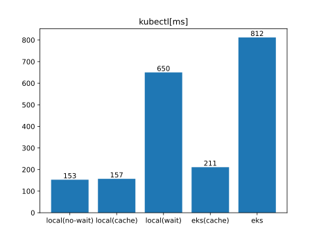

### Requirements
- docker
- kind
- kubectl
- jq
- yj
- gdat
- gsed
- aws

### Usage

```sh
export KUBECONFIG="kubeconfig.yaml"
export KUBE_CREDENTIAL_CACHE_FILE=".tmp/cache.json"
export KUBECONFIG_EKS=<your kubeconfig to access EKS>
export KUBECONTEXT_EKS=<your kube-context to access EKS>
export KUBECONTEXT_EKS_CACHE=<your kube-context to access EKS with cache>
export AWS_PROFILE_EKS=<your AWS_PROFILE to access EKS>

# run benchmark
make bench

# teadown
make reset
```

### Result


raw data

```sh
$ make bench
kubectl version --short 2>/dev/null
Client Version: v1.24.3
Kustomize Version: v4.5.4
Server Version: v1.24.0
go test -bench . -cpu 1 -benchtime 10s
goos: darwin
goarch: arm64
pkg: github.com/ryodocx/kube-credential-cache/benchmark
BenchmarkKubectlEKS                   14         811727732 ns/op # kubectl version (eks)
BenchmarkKubectlEKSCache              52         211486883 ns/op # ↑ + cache
BenchmarkGetCredentialEKS             21         539992825 ns/op # aws eks get-token --cluster-name example
BenchmarkGetCredentialEKSCache      6676           1729496 ns/op # kcc-cache aws eks get-token --cluster-name example
BenchmarkKubectlNoWait                70         152811295 ns/op # kubectl version --user kind-kcc-bench (no wait)
BenchmarkKubectlCache                 75         156802654 ns/op # kubectl version --user cache (use get-credential-wait.sh with kcc-cache)
BenchmarkGetCredentialCache         6933           1743538 ns/op # kcc-cache sh get-credential-wait.sh
BenchmarkKubectlSlow                  16         650367846 ns/op # kubectl version --user slow  (use get-credential-wait.sh only)
BenchmarkGetCredentialSlow            22         496425106 ns/op # sh get-credential-wait.sh
PASS
ok      github.com/ryodocx/kube-credential-cache/benchmark      98.958s
```





